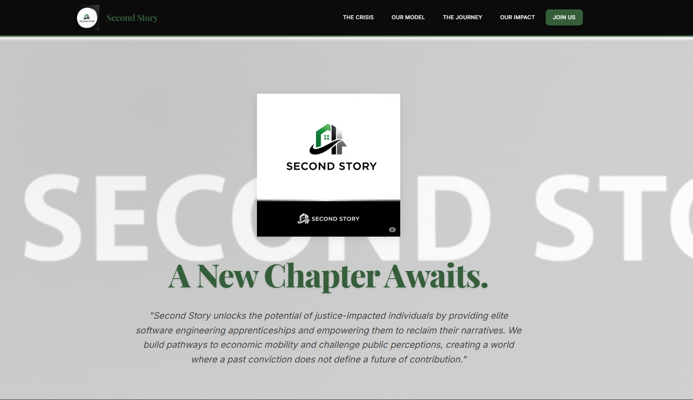
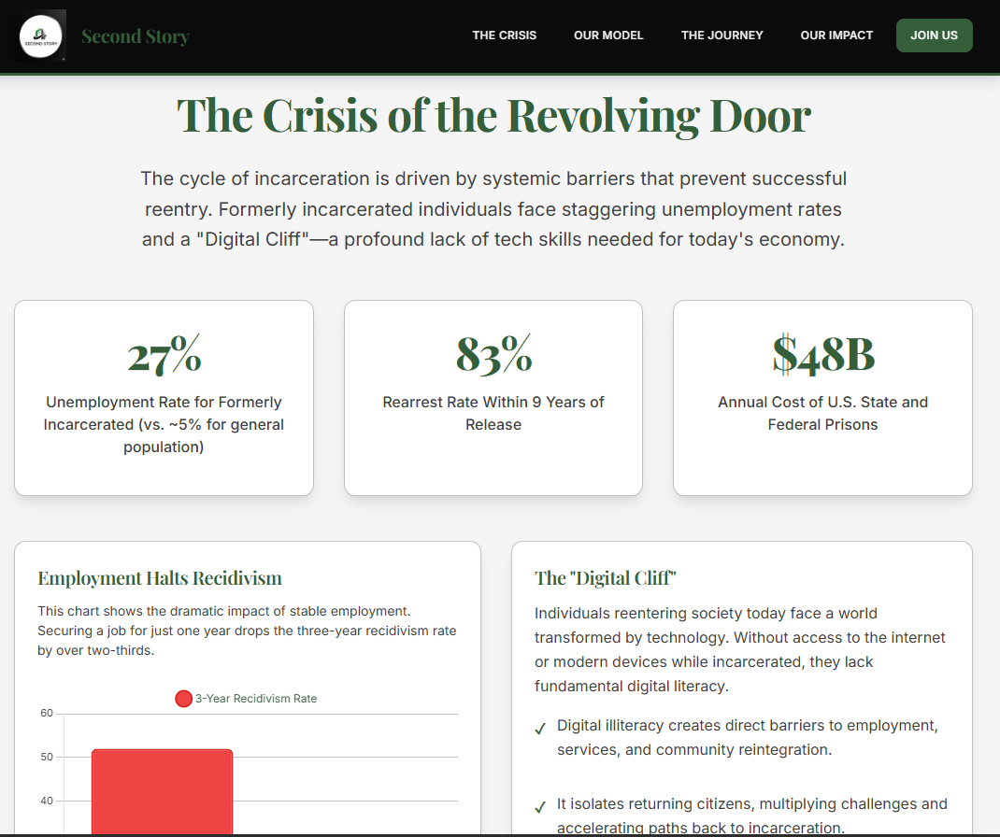
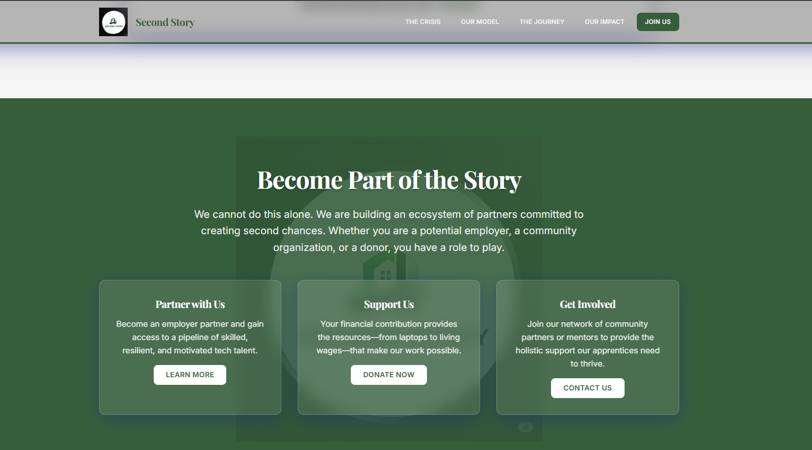

# Second Story: Code, Narrative, and Opportunity

A modern, professional landing page for Second Story - an innovative program that unlocks the potential of justice-impacted individuals through elite software engineering apprenticeships and narrative empowerment. Featuring cutting-edge glassmorphism design and advanced typography.

## 🎯 Project Overview

This project transforms data-driven insights into a compelling narrative-driven web experience that guides visitors from understanding the systemic problem to seeing the innovative solution and its projected impact. Built with modern web technologies and featuring a sophisticated glassmorphism design system.

## 📸 Screenshots





*The modern, professional Second Story website featuring glassmorphism design elements, enhanced typography, and interactive data visualizations.*



## ✨ Features

### 🎨 Modern Design System

- **Glassmorphism Design** with translucent backgrounds and backdrop blur effects
- **Enhanced Typography** with multiple font families (Inter, Playfair Display, JetBrains Mono)
- **Hunter Green Color Palette** with professional CSS custom properties
- **Advanced Visual Hierarchy** with improved spacing and responsive scaling
- **Floating Animations** and smooth micro-interactions
- **Multi-layer Background Gradients** with transparency effects

### 🌐 Modern Web Standards

- **Semantic HTML5** with proper accessibility attributes and brand integration
- **Progressive Enhancement** ensuring core functionality without JavaScript
- **Responsive Design** optimized for all device sizes with mobile-first approach
- **Performance Optimized** with efficient loading, minification, and animations
- **Cross-browser Compatibility** with proper vendor prefixes
- **Modern CSS Features** including backdrop-filter, custom properties, and grid

### 📊 Interactive Data Visualizations

- **Animated Statistics** that engage on scroll with smooth counter animations
- **Chart.js Integration** for compelling data presentation
- **Interactive Budget Charts** with year-over-year comparison functionality
- **Tabbed Journey Interface** showcasing the apprentice experience
- **Responsive Charts** that adapt to different screen sizes

### ♿ Accessibility & UX

- **WCAG 2.1 AA Compliant** with proper ARIA labels and semantic markup
- **Keyboard Navigation** support throughout all interactive elements
- **Screen Reader Optimized** with descriptive text and proper headings
- **Focus Management** with visible focus indicators
- **Reduced Motion** respect for user accessibility preferences
- **High Contrast** support for users with visual impairments

### 🏗️ Professional Architecture

- **Separation of Concerns** with modular CSS and JavaScript
- **Component-Based CSS** with BEM-inspired naming conventions
- **Advanced CSS Custom Properties** for consistent theming
- **Error Handling** and graceful degradation
- **Performance Monitoring** built-in with efficient resource loading

## 🚀 Quick Start

### Prerequisites

- A modern web browser (Chrome, Firefox, Safari, Edge)
- Optional: Node.js for development tools

### Installation

1. Clone the repository:

   ```bash
   git clone https://github.com/StrayDogSyn/Second_Story_Splash.git
   cd Second_Story_Splash
   ```

2. For development with live reload:

   ```bash
   npm install
   npm run dev
   ```

3. Or simply open `index.html` in your browser for immediate viewing.

## 📁 Project Structure

```text
Second_Story_Splash/
├── index.html              # Main landing page with semantic markup
├── css/
│   └── styles.css          # Comprehensive styles with glassmorphism
├── js/
│   └── app.js              # Interactive functionality and animations
├── assets/
│   ├── brand/              # Second Story brand assets and logos
│   │   ├── 2ndStory01.png        # Primary logo
│   │   ├── 2ndStoryBanner.png    # Banner logo
│   │   ├── 2ndStoryBanner2.png   # Secondary banner
│   │   └── 2ndStoryCircle.png    # Circular logo variant
│   ├── docs/               # Design system documentation
│   │   └── COLOR_IMPLEMENTATION.md  # Color palette guide
│   └── screenshots/        # Project screenshots for documentation
│       ├── Main.png              # Website homepage screenshot
│       └── Crisis.png            # Crisis data visualization
├── package.json           # Build configuration and dependencies
├── vercel.json            # Deployment configuration for Vercel
├── .vercelignore          # Files to exclude from deployment
├── README.md             # Comprehensive project documentation
└── LICENSE               # MIT license
```

## 🎨 Design System & Architecture

### Glassmorphism Design Language

The website features a cutting-edge glassmorphism design system with:

- **Backdrop Blur Effects**: Using backdrop-filter with webkit fallbacks
- **Translucent Backgrounds**: Strategic use of rgba and hsla color values
- **Glass Borders**: Subtle translucent borders with multiple layers
- **Advanced Shadow System**: Multi-layer shadows for depth and hierarchy
- **Floating UI Elements**: Proper z-index management for layered interfaces

### Enhanced Typography System

- **Primary Font**: Inter (Google Fonts) - Modern, professional sans-serif
- **Display Font**: Playfair Display - Elegant serif for headings
- **Monospace Font**: JetBrains Mono - Technical elements and code
- **Typography Variables**: Comprehensive system for spacing and sizing
- **Advanced Metrics**: Enhanced line-height, letter-spacing, and word-spacing

### Hunter Green Brand Palette

The website features a comprehensive Hunter Green color scheme with strategic brand asset integration:

- **Hunter Green**: `#355E3B` (Primary - Logo, buttons, headlines, icons)
- **Jet Black**: `#0B0B0B` (Accent - Hero backgrounds, footers, navigation)
- **Charcoal**: `#1E1E1E` (Dark Gray - Text on dark backgrounds, secondary headers)
- **Soft White**: `#F5F5F5` (Light Contrast - Backgrounds, section dividers, cards)
- **Sage Gray-Green**: `#A3B9A4` (Secondary - Hover states, secondary buttons, highlights)
- **Graphite**: `#3F3F3F` (Utility - Body text, border lines, subdued content)
- **Metallic Silver**: `#C2C2C2` (Highlight - Icon outlines, UI separators, accent lines)

### CSS Custom Properties

```css
/* Glassmorphism Variables */
--glass-white: rgba(255, 255, 255, 0.25);
--glass-light: rgba(255, 255, 255, 0.15);
--glass-border: rgba(255, 255, 255, 0.2);
--glass-shadow: 0 8px 32px 0 rgba(31, 38, 135, 0.37);

/* Blur Levels */
--blur-xs: blur(2px);
--blur-sm: blur(4px);
--blur-md: blur(16px);
--blur-lg: blur(24px);

/* Typography System */
--font-primary: 'Inter', system-ui, sans-serif;
--font-display: 'Playfair Display', Georgia, serif;
--font-mono: 'JetBrains Mono', 'Consolas', monospace;
--line-height-relaxed: 1.625;
--letter-spacing-wide: 0.025em;
```

### Layout System

- **Container**: Max-width 1200px with responsive padding
- **CSS Grid**: Advanced grid layouts with glassmorphism integration
- **Flexbox**: Flexible component arrangements
- **Spacing Scale**: Consistent scale using CSS custom properties

## 🛠 Development & Architecture

### Modern CSS Architecture

The CSS follows a sophisticated component-based architecture featuring:

- **Glassmorphism Component System** with reusable glass effects
- **Advanced CSS Custom Properties** for comprehensive theming
- **Utility-First Classes** for rapid development and maintenance
- **Progressive Enhancement** with webkit fallbacks for broader compatibility
- **Performance-Optimized** loading with critical CSS inlining

### Enhanced JavaScript Modules

The JavaScript is organized as a single class with modern separation of concerns:

- **Navigation Management**: Smooth scrolling with glassmorphism-aware mobile menu
- **Animation Controllers**: Advanced scroll-triggered and counter animations
- **Glassmorphism Integration**: Dynamic glass effects and backdrop management
- **Chart Management**: Optimized Chart.js integration with glass-themed visualizations
- **Interaction Handlers**: Enhanced tabs, buttons, and form interactions with glass effects

### Modern Build Process

- **CSS Minification**: CSSO for optimized stylesheet delivery
- **JavaScript Compression**: UglifyJS for reduced bundle sizes
- **Font Optimization**: Strategic Google Fonts loading with display swap
- **Static Asset Optimization**: Vercel's edge network for global delivery

### Performance Optimizations

- **Lazy Loading**: Charts and heavy assets only initialize when needed
- **Throttled Scroll Events**: Optimized scroll listeners with requestAnimationFrame
- **Efficient Glass Effects**: Hardware-accelerated backdrop-filter with fallbacks
- **Resource Preloading**: Critical fonts, styles, and brand assets
- **Modern Image Formats**: Optimized PNG assets with progressive loading

## 🔧 Glassmorphism Utility Classes

The project includes a comprehensive set of utility classes for implementing glassmorphism effects:

### Glass Background Classes

```css
.glass-white      /* Translucent white background */
.glass-light      /* Light glass effect */
.glass-medium     /* Medium opacity glass */
.glass-dark       /* Dark glass background */
```

### Blur Effect Classes

```css
.blur-xs          /* Subtle 2px blur */
.blur-sm          /* Small 4px blur */
.blur-md          /* Medium 16px blur */
.blur-lg          /* Large 24px blur */
```

### Glass Component Classes

```css
.glass-card       /* Complete glass card with border and shadow */
.glass-nav        /* Navigation glass styling */
.glass-button     /* Glass button effects */
.glass-panel      /* Large glass panel styling */
```

### Usage Examples

```html
<!-- Glass card with medium blur -->
<div class="glass-card blur-md">
  <h3>Glass Card Title</h3>
  <p>Content with glassmorphism effect</p>
</div>

<!-- Glass navigation -->
<nav class="glass-nav blur-sm">
  <ul>...</ul>
</nav>
```

## 📊 Data Visualizations

### Employment & Recidivism Chart

- **Type**: Bar chart comparing unemployed vs employed recidivism rates
- **Data**: 52% vs 16% three-year recidivism rates  
- **Glass Integration**: Translucent chart backgrounds with backdrop blur
- **Purpose**: Demonstrates the power of employment in reducing recidivism

### Job Placement Chart

- **Type**: Doughnut chart showing placement goals
- **Data**: 90% placement target in tech roles
- **Glass Styling**: Floating glass legend with transparent tooltips
- **Purpose**: Illustrates program success metrics

### Salary Comparison Chart

- **Type**: Bar chart comparing average salaries
- **Data**: $56k average vs $85k Second Story graduates
- **Visual Enhancement**: Glass-themed data labels and hover effects
- **Purpose**: Shows economic mobility potential

### Budget Allocation Chart

- **Type**: Interactive horizontal bar chart with glass theming
- **Data**: Two-year budget breakdown by category
- **Interactive Features**: Glass hover states and translucent tooltips
- **Purpose**: Transparent funding allocation demonstration

## 🔧 Browser Compatibility & Performance

### Modern Browser Support

- **Chrome/Edge 88+**: Full glassmorphism support with backdrop-filter
- **Firefox 103+**: Complete feature support including backdrop blur
- **Safari 14+**: Native backdrop-filter support on macOS/iOS
- **Mobile Browsers**: Progressive enhancement with graceful fallbacks

### Performance Targets (with Glassmorphism)

- **First Contentful Paint**: < 1.8s (including glass effects)
- **Largest Contentful Paint**: < 2.8s (with backdrop-filter)
- **Cumulative Layout Shift**: < 0.1 (stable glass layouts)
- **First Input Delay**: < 100ms (optimized glass interactions)

### Fallback Strategy

For browsers without backdrop-filter support:

- **Gradient Backgrounds**: CSS gradients replace blur effects
- **Solid Backgrounds**: Fallback to solid colors with transparency
- **Progressive Enhancement**: Core functionality remains intact

## 🚀 Deployment & Hosting

### Vercel Integration

The project is optimized for Vercel deployment with:

- **Static Build Configuration**: Custom vercel.json for optimal delivery
- **Edge Network**: Global CDN for enhanced performance
- **Automatic HTTPS**: SSL certificates and security headers
- **Build Optimization**: Minified CSS and JavaScript assets

### Quick Deploy

1. **Fork the repository** to your GitHub account
2. **Connect to Vercel**: Import project from GitHub
3. **Deploy**: Automatic deployment with zero configuration
4. **Custom Domain**: Optional custom domain setup

### Build Commands

```bash
# Install dependencies
npm install

# Development server
npm run dev

# Production build
npm run build

# Deploy to Vercel
vercel --prod
```

### Environment Configuration

The project uses static assets with no environment variables required. All configuration is handled through:

- **CSS Custom Properties**: Comprehensive design system tokens
- **Glassmorphism Variables**: Centralized glass effect configuration
- **Typography System**: Advanced font loading and spacing variables
- **Inline Configuration**: Chart.js data with glass-themed styling
- **Static Assets**: Optimized brand images and documentation

### Production Optimizations

For production deployment, the build process includes:

```bash
npm run build
```

This will:

- **Minify CSS**: Optimize glassmorphism styles with CSSO
- **Compress JavaScript**: UglifyJS for enhanced performance
- **Optimize Typography**: Font subsetting and display swap
- **Asset Optimization**: PNG compression and progressive loading
- **Glass Effect Optimization**: Efficient backdrop-filter implementations

## 🤝 Contributing

1. Fork the repository
2. Create a feature branch (`git checkout -b feature/amazing-feature`)
3. Commit your changes (`git commit -m 'Add amazing feature'`)
4. Push to the branch (`git push origin feature/amazing-feature`)
5. Open a Pull Request

### Code Standards

- **HTML**: Semantic, accessible markup
- **CSS**: BEM-inspired naming, mobile-first
- **JavaScript**: ES6+, functional approach
- **Comments**: Clear documentation for complex logic

## 📱 Responsive Breakpoints

- **Mobile**: < 768px
- **Tablet**: 768px - 1023px
- **Desktop**: 1024px+
- **Large Desktop**: 1200px+

## ♿ Accessibility Features

- **Semantic HTML**: Proper heading hierarchy and landmarks
- **ARIA Labels**: Comprehensive labeling for interactive elements
- **Keyboard Navigation**: Full keyboard accessibility
- **Screen Reader Support**: Optimized announcements and descriptions
- **Color Contrast**: WCAG AA compliant contrast ratios
- **Focus Indicators**: Clear visual focus states

## 📈 Performance Optimizations

- **Critical CSS**: Inline critical styles for faster rendering
- **Font Loading**: Optimized Google Fonts loading
- **Image Optimization**: Responsive images with proper sizing
- **JavaScript Splitting**: Modular loading for better caching
- **Animation Performance**: Hardware-accelerated transforms

## 🔍 SEO Features

- **Meta Tags**: Complete Open Graph and Twitter Card support
- **Structured Data**: Schema.org markup for search engines
- **Semantic HTML**: Proper document structure for crawlers
- **Performance**: Fast loading times improve search ranking

## 📄 License

This project is licensed under the MIT License - see the [LICENSE](LICENSE) file for details.

## 🙏 Acknowledgments

- **Chart.js**: Beautiful, responsive charts
- **Inter Font**: Modern, readable typography
- **CSS Grid**: Modern layout capabilities
- **Intersection Observer API**: Efficient scroll-based animations

## 📞 Contact

### Second Story

- Website: [https://secondstory.org](https://secondstory.org)
- Email: [contact@secondstory.org](mailto:contact@secondstory.org)

---

**Building pathways to economic mobility through technology and storytelling.**
